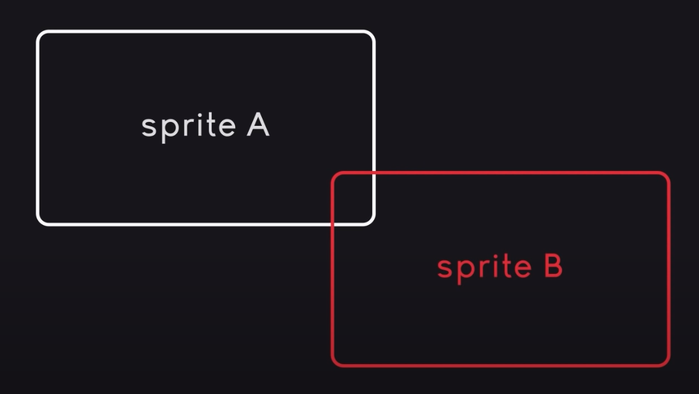

# Level class
Stará se o veškerý tok hry. Máme hromadu sprites, potřebujeme je tedy rozdělit na následujicí kategorie
* `visible_sprites` - všechno, co se vykreslí na obrazovku
* `obstacle_sprites` - všechno, co může mít kolizi s hráčem, ale nejsou vykresleny
vzhledem ke skupině budou interakce s hráčem trochu jiné, což nám usnadňí práci a vyčistí kód

Pozice hráče na mapě je index, ale musí se to ještě vynásobit velikostí jednoho bloku, v tomto případě 64 pixelů (`TILESIZE`)

Pokud máme dva sprity

Nevíme, jestli kolize probíhá zprava nebo zespodu, hráč by se tedy divně posouval okolo objektu, a celé by to vypadalo zabugovaně. Proto potřebujeme separátně čeknout vertikální a horizontální pozici, tak, že přemístíme hráče a určíme, jestli proběhla kolize, pokud ano, posuneme ho na místo kolize

## Sprite group
protože potřebujeme definovat nějaké metody, potřebujeme group, ta dělá tyhle věci
1. ukládá sprity, vykresluje je a updatuje je
2. potřebujeme custom draw funkci která nám dá možnost vytvořit iluzi hloubky pomocí kamery, pomocí overlapu
    * kamera je pouze offset vektor na čtverci hráče
    * pro overlap ale potřebujeme prioritu spritů, abychom věděli co máme kde vykreslit

Máme hodně spritů, proto používáme program na jejich třídění - Tiled. Z toho získáme obrázek, který se bude pohybovat s hráčem

`Tile` class musí být schopna fungovat s i bez grafiky, protože collision maps nemaj grafiku, ale potřebují kolize
